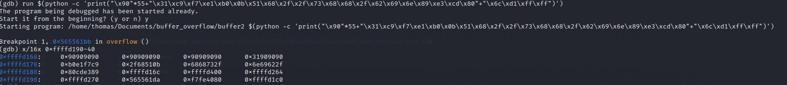
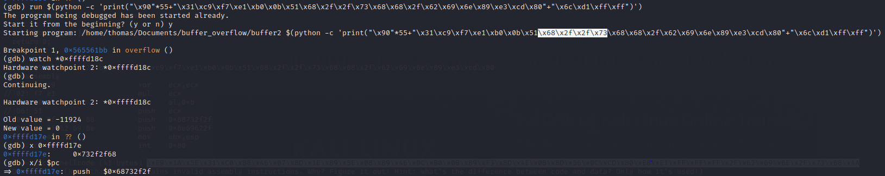
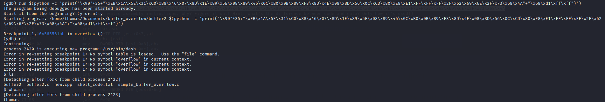

 Een buffer is een geheugen opslag die tijdelijk data vasthoud terwijl de data van de ene plek naar de andere
wordt overgezet. Een buffer overflow wordt veroorzaakt wanneer de volume van de data de geheugen opslag(buffer) overschrijdt.
Als gevolg hiervan wordt de data in meerdere geheugen opslagen overschreden.

### Uitleg
Een aanvaller kan een buffer overflow uitvoeren door het overschrijven van het geheugen van de applicatie.
Via het overschreden deel kan de aanvaller verschillende stukken schadelijke code uit voeren. Bijvoorbeeld kunnen ze nieuwe
instructies naar de applicatie sturen om toegang te krijgen tot het IT systeem.
   
Als aanvallers weten hoe het geheugen van de applicatie in elkaar steekt, kunnen ze gerichte aanvallen uitvoeren. 
Stel er is een bufer om in te loggen, deze verwacht gebruikersnaam en wachtwoord data van 8 bytes.
Als deze data niet met 8 bytes, maar met 10 bytes wordt verstuurd (2 meer dan verwacht). kan het programma deze data ergens anders buiten de buffer naartoe schrijven.
In deze 2 bytes kan de aanvaller dus schadelijke code zetten.

### Interesse
De reden waarom ik graag me wil verdiepen in buffer overflow aanvallen is, omdat ik dit heel vaak voorbij hoor komen. Het is een bekend aanvalsvector,
die mij erg interessant lijkt. In CSA ben ik hier al eerder mee bezig geweest, maar was het voor mij nog wel best vaag.  
Zo vind ik het hele proces en theorie achter buffer overflow vrij lastig en weet ik niet echt wat het in houdt en hoe ik dit kan uitvoeren.
Het lijkt mij persoonlijk erg leuk om met aspecten als geheugen aan de slag te gaan!
Ik hoop dan ook dat door het begrijpen en kunnen van een buffer overflow, ik mijn kennis en kunnen op het gebied van red teaming vergroot. 
Deze ervaring kan ik dna gebruiken in komende pentesten die ik dit en komende jaren ga uitvoeren.

### Youtube video's
[Simple buffer overflow](https://www.youtube.com/watch?v=B4v56Ns3QhQ&ab_channel=JamesLyne)
[Buffer overflow complex](https://www.youtube.com/watch?v=Rg_h-XIJ1c4&ab_channel=LiveOverflow)

### Buffer overflow eenvoudig
Om het idee achter een buffer overflow te begrijpen heb ik een simpel code geschreven in C. Deze code is gevoelig voor een buffer overflow,
 maar dit geeft mij wel een goed idee over hoe een buffer overflow in praktijk werkt.
   Het programma ziet er als volgt uit:
 
 
 Deze code voert simpel weg een check uitof het wachtwoord(maximaal 16 bytes) gelijk is aan "password". Als dit het geval is wordt er een integer
 op '1' gezet en wordt er een gevoelig bestand uitgelezen. Maar als je een hacker mindset opzet denk je meteen, maar wat als ik meer dan 16 bytes meegeef?
 Exact dat is wat een buffer overflow veroorzaakt! Hieronder zie je dat ik dus inderdaad meer bytes meegeef dan het programma eigenlijk verwacht en wat
 er dan gebeurt is dat de overige bytes in andere buffers(in dit geval de *passcheck*) wordt opgeslagen. Deze variabele is dus gevuld en deze bijbehorende check
 zal dus voldoen, hierdoor wordt het bestand uitgelezen zonder enig wachtwoord.
  
  
### Buffer overflow complex
Nu een complexere uitvoering van een buffer overflow, het is een eenvoudig script maar de uitvoering gaat in de diepte.
 

 
 
 

 

 

### HTB
Coming soon....

