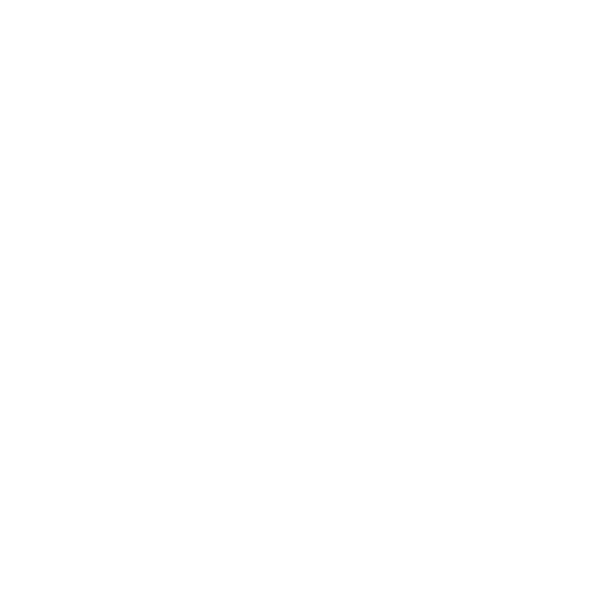

## Thomas van Heel - Cyber Security

Welkom bij mijn e-portfolio! Dit e-portfolio is opgesteld ter verantwoording van de cyber security minor. Hierin wil ik jullie graag meenemen in mijn minor periode. Dit portfolio zal alles te maken hebben met cyber security, in het specifiek mijn gekozen richting: Red Teaming. Red Teaming heb ik gekozen, omdat hier mijn hart en intresses het meeste liggen. Alle aspecten van security spreken me aan, maar de aanvallende kant is de kant waar ik me graag in verder wil ontwikkelen. [Project(en)](https://tvheel.github.io/project), leermomenten, informatie etc. wordt allemaal beschreven.
 
 

    

        
        

            <h4><b>Learning plan</b></h4>
        

    

    

        
        

            <h4><b>R&D project</b></h4>
        

    

    

        
        

            <h4><b>Resultaten</b></h4>
        

    

Hieronder zijn alle leerdoelen beschreven en op welk niveau ik hierbij zit.

### Leerdoel 1: Personal development
You show that you can plan, manage and evaluate your personal development and learning.

| Criterium                                                                                           |   Advanced (week 17,  G-O level)                                                                                                                                                                              |   Proficient (week 17,  S-G level)                                                                                                                                         |   Beginning                                                                                                                                           |   Orienting (week 2)                                                                                                                                                     |   Undefined                                                                                                                 |
|-----------------------------------------------------------------------------------------------------|---------------------------------------------------------------------------------------------------------------------------------------------------------------------------------------------------------------|----------------------------------------------------------------------------------------------------------------------------------------------------------------------------|-------------------------------------------------------------------------------------------------------------------------------------------------------|--------------------------------------------------------------------------------------------------------------------------------------------------------------------------|-----------------------------------------------------------------------------------------------------------------------------|
|   Personal Development   You are working on a clear and meaningful personalized learning plan.      |   You have completed and evaluated your personal learning plan,  activities and outcomes, and you show to help, inform and assist others,  with positive feedback from teachers, students and externals.      |   You have completed and evaluated your personal learning plan,  activities and outcomes, and the teacher(s) has/have confirmed this by  providing positive feedback.      |   You have an approvedpersonalized learning plan and in your portfolio  you demonstrate and evaluate the first learning activities and outcomes.      |   You have a global or basic learning plan but you can personalize or  detail it more, or you can explain and evaluate the learning  activitiesand outcomes better.      |   Your portfolio does not show for a personal learning plan, or the demonstration is not clear enough for the teachers.     |

### Onderbouwing (Personal Development)
test

### Leerdoel 2: Security Specialist
You show that you are a  security specialist with the required technical and procedural skills.

| Criterium                                     |   Advanced (week 17,  G-O level)                                                                                                                                                             |   Proficient (week 17,  S-G level)                                                                                                                                                                         |   Beginning                                                                                                                                                                                 |   Orienting (week 3)                                                                                                                                                    |   Undefined                                                                                                                                                                                  |
|-----------------------------------------------|----------------------------------------------------------------------------------------------------------------------------------------------------------------------------------------------|------------------------------------------------------------------------------------------------------------------------------------------------------------------------------------------------------------|---------------------------------------------------------------------------------------------------------------------------------------------------------------------------------------------|-------------------------------------------------------------------------------------------------------------------------------------------------------------------------|----------------------------------------------------------------------------------------------------------------------------------------------------------------------------------------------|
|   Technical skills as a security specialist   |   Your portfolio shows that you are a technical security expert with  complete and in-depth knowledge and skills, and that you can help,  inform and assist others.                          |   Your portfolioshows  that you can perform the main  technical specialist tasks in a skilled manner and the teacher has  confirmed this by providing positive feedback.                                   |   Your portfolio shows first technical learningactivities and products  as a security specialist. Teacher feedback shows that the quality of  your skills is satisfactory.                  |   You have started developing your technical security skills, but not  produced and evaluated any completed learning activities yet.                                    |   Your portfolio does not yet demonstrate any progression as a  technical security specialist, or the demonstration is not clear enough  for the teachers.                                   |
|   Procedural skills as a security specialist  |   Your portfolio shows that you have demonstrated AND IMPROVED security  procedures and reporting products for the chosen specialism. Teachers  have confirmed this with positive feedback.  |   In your portfolio you demonstrateand evaluate the main procedural best-practices and reporting productsof a security specialist, and the teacher has confirmed this by providing positive feedback.      |   Your portfolio shows your first procedural activities and reporting  products as a security specialist. Teacher feedback shows that the  quality of your skills is satisfactory.          |   You have started developing your procedural and reporting skills as a security specialist, but not produced and evaluated any completed learning activities yet.      |   Your portfolio does not yet demonstrate any progress on the  procedural and reporting side of being a security specialist, or the  demonstration is not clear enough for the teachers.     |

Technical Red teaming skills are related to (IT) security technical skills, such as (but not limited to): hacking techniques (scripting, enumeration, privesc, pivoting, covert channels, exploitation, cracking, ...), physical security (locks, physical access tokens), offensive hardware (rubber ducky, dropbox, etc.), different target platforms (IoT, OT, mobile, ..) and environments (Windows, Linux, Android, ...).

### Onderbouwing (Technical skills)
I have done a lot of work on expanding my red teaming technical skills. I have learned a lot of hacking techniques from [Hack the Box](/results/htb) where I also learned how to target different platforms(Windows, Linux, OpenBSD), physical security aspects and offensive hardwared from using: P4wnp1, wifi pineapple, rubber ducky, packet squirrel and dropbox which I described in [P4wnP1](/results/p4wnp1) and [Tooling](/results/tooling). I also did IoT security testing described in [R&D Project](project).

Procedural red teaming skills are related to working in a structured way and reporting activity and results.
Working in a structured way: using proven (real world) methods/phases to perform pentests and red teaming operations, planning activities by considering efficiency combined with risk of damage and exposure. Working with written consent, ethically,  and in close cooperation with white team to prevent accidents.
Reporting activity and results:  written report to client/blue team/development (accompanied with a presentation), registering performed red teaming activity (was it a red teamer or a malicious actor?), documenting security tests (secure code review report, what is and isn't tested). Written responsible disclosure and PoCs. Knowledge sharing with peers in the field (informal, online, conferences).

### Onderbouwing (Procedural skills)
test

### Learning outcome 3: Research and development skills
In a complex innovation oriented project setting, you show a methodical approach to research and development, technical R&D skills, and project collaboration and communication skills.

| Criterium                                 |   Advanced (week 17,  G-O level)                                                                                                                                                                                                                                                         |   Proficient (week 17,  S-G level)                                                                                                                                                                                                                                           |   Beginning                                                                                                                                                                                                                                                                 |   Orienting (week 2)                                                                                                                                                                                                                       |   Undefined                                                                                                                                                                                                    |
|-------------------------------------------|------------------------------------------------------------------------------------------------------------------------------------------------------------------------------------------------------------------------------------------------------------------------------------------|------------------------------------------------------------------------------------------------------------------------------------------------------------------------------------------------------------------------------------------------------------------------------|-----------------------------------------------------------------------------------------------------------------------------------------------------------------------------------------------------------------------------------------------------------------------------|--------------------------------------------------------------------------------------------------------------------------------------------------------------------------------------------------------------------------------------------|----------------------------------------------------------------------------------------------------------------------------------------------------------------------------------------------------------------|
|   Technical R&D project skills            |   You have demonstrated, validated and evaluated to be able to select  and apply complex technology with (project) success for the required  innovation.                                                                                                                                 |   You have demonstrated and validated that you have completed technical  R&D tasks in a project and the teacher(s) has/have confirmed this  by providing positive feedback.                                                                                                  |   Your portfolio shows that and how you are working on technical  R&D tasks and activities in a project. Teacher feedback shows that  the quality of your skills is satisfactory.                                                                                           |   You have started technical R&D tasks, but not completed and verified the project results yet.                                                                                                                                            |   Your portfolio does not yet demonstrate any progression as a  technical security specialist, or the demonstration is not clear enough  for the teachers.                                                     |
|   Methodical R&D project process          |   You have demonstrated and validated, but also took the lead in a  methodical approach to research and development activities, and you have  informed, helped and assisted others, with positive feedback from  students, teachers, and externals.                                      |   You have demonstrated and validated a methodical approach to research  and development activities (research approach, analysis, design,  implementing ánd testing) in a project and the teacher(s) has/have  confirmed this by providing positive feedback.                |   Your portfolio shows that you have selected methodical R&D  approaches and that and how you are working on R&D project tasks in a  methodical manner.                                                                                                                     |   Your portfolio shows that you have selected methodical research and  development approaches (for research approach, analysis, design,  implementing ánd testing), but you have not completed and verified the  project results yet.      |   Your portfolio does not yet demonstrate how you can perform the  research and development activities in the project in a methodical  manner. or the demonstration is not clear enough for the teachers.      |
|   Collaboration and Communication skills  |   Your portfolio demonstrates that you independently set up and  performed internal and external project management, and written and oral  communication, with evaluation and reflection and positive feedback  from the project client, the teacher(s) and your project group members.  |   Your portfolio demonstrates how you collaborated within the project  team and with stakeholders, ánd how you worked on communication  activities and products, with evaluation and reflection, and positive  feedback from the teacher(s) and your project group members.  |   Your portfolio demonstrates how you collaborated within the project  team, and how you are working on any communication activities and  products. Some activities are completed and the results evaluated and  reflected on, with positive feedback from the teacher(s).  |   Your portfolio shows how you are collaborating within the project  team, and/or communication activities and products that you are working  on, but you have not completed and evaluated them yet.                                       |   Your portfolio does not demonstrate and evaluate project  management/collaboration activities or communication products, or the  demonstration is not clear enough for the teachers.                         |

### Onderbouwing (Technical R&D project skills)
I think my Technical R&D project skills is at beginning, at this moment I have not yet described enough of our work that it's enough to confirm this learning outcome.
I will expand this in the comming weeks.

{:.geh}
### Onderbouwing (Methodical R&D project process)
test

### Onderbouwing (Collaboration and Communication skills)
test