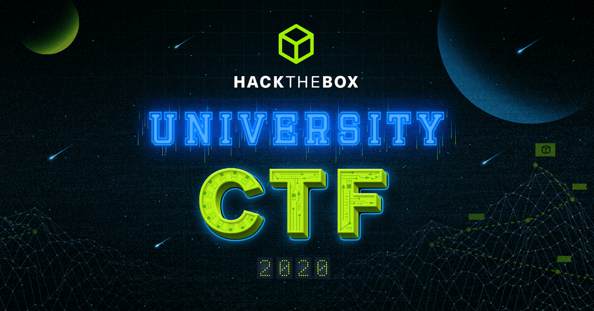

Vaak vinden Capture the flags (CTF’s) plaats tijdens een van de vele securityconferenties over de hele wereld. Al in 1996 werd er een CTF georganiseerd tijdens Def Con, een grote en bekende cyberbeveiligingconferentie die jaarlijks wordt gehouden in Las Vegas. Naarmate het internet groeide, groeide ook de CTF-competities en kon ook het internet gebruikt worden om waar dan ook ter wereld mee te doen. Tegenwoordig zijn CTF’s voor iedereen en overal bereikbaar en kun je online direct deelnemen.

Tijdens deze minor ben ik al veel bezig geweest met Hack the Box, nu heeft deze organisatie een CTF georganiseerd ([HTB x Uni CTF](https://ctf.hackthebox.eu/)).
Hierin heb ik samen met 10 andere een groep gevormd en onze school vertegenwoordigd tijdens deze internationale competitie. 

## Voorbereiding
Ter voorbereiding op deze CTF hebben wij als groep een discord aangemaakt voor de communicatie. Bovendien
was Michel Bijnen als groepsleider verkozen, om zo duidelijk een aanspreekpunt te hebben.
Onderling hebben we elkaar ontmoet en dit lied bij mij een goede indruk achter. Verder zijn er 
tijdens deze kennismaking afspraken gemaakt omtrent challenges uitvoeren, kanalen aanmaken etc.

Door middel van deze CTF verwachtte ik veel te leren en ervaring op te doen rondom het pentesten/CTF's spelen. 

## Challenges
Tijdens de 72 uur durende CTF heb ik mee geholpen op verschillende vlakken van het pentesten. 
Zowel forensisch, reverse engineering, miscellanous en webapplicaties. Hiermee kreeg ik meer ervaring en kennis op meerdere gebieden.
Zo kwam ik erachter dat reverse engineering echt iets is wat ik leuk vind om te doen.

Qua webapplicaties heb ik meegedaan met Gunship, Web-WAFfles en Bonechewer. Deze waren stiekem best pittig en vereiste veel stappen om
de uiteindelijke vlag te bemachtigen. Als resultaat van hard werken hebben we Gunship weten op te lossen!

Verder heb ik samen met Michel Bijnen een reverse engineering weten op te lossen: Buggy Time Machine. Dit vereiste veel geduld en veel
wiskunde - en rekenwerk. Uiteindelijk om 4:00 's nachts wistten wij deze challenge te halen, voor maar liefst 500 punten.
Verder heb ik samen met Sem en Michel ook gewerkt aan Coffee Invocation. Deze reverse engineering opdracht had de hoogste moeilijkheidsgraad, maar
we zaten echt héél dichtbij. Echter, heeft de tijd het gewonnen in deze challenge. Wel heb ik hier heel veel van geleerd, zoals: tools en gedachtegang.

De andere twee onderwerpen heb ik ook mee geholpen, dit heeft niks opgeleverd aangezien de kennis hier nog net niet goed genoeg voor was. 
Deze CTF heeft mij wel op een nieuwe weg gezet, in mijn (vrije) tijd ben ik meer bezig met CTF uitdagingen dan ooit te voren. Zo ben
ik op dit moment ook bezig met uitdagingen van de [picoCTF](https://picoctf.org/).

## Tot slot
Ter bewijslast van de behaalde challenges hebben we een write-up [document(TODO!)]() gemaakt waarin alles staat.
Verder gaan wij als groep van 10 man vaker CTF's spelen! Ik verheug me hier erg op!