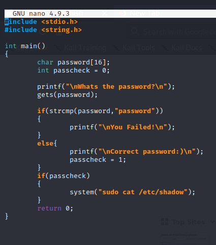
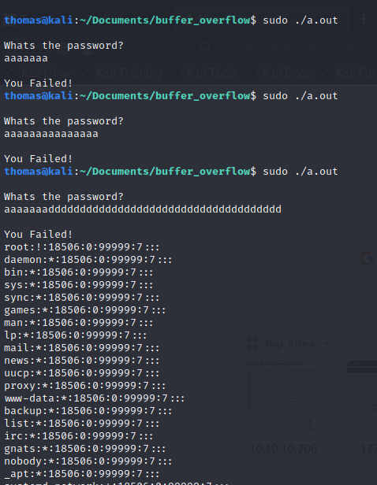
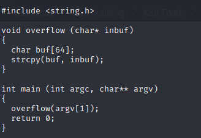
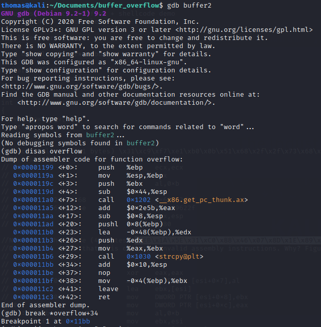
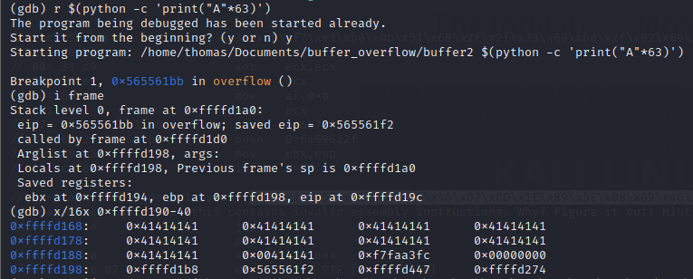
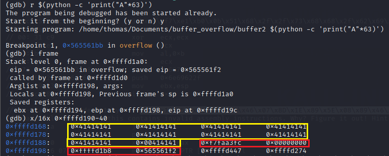
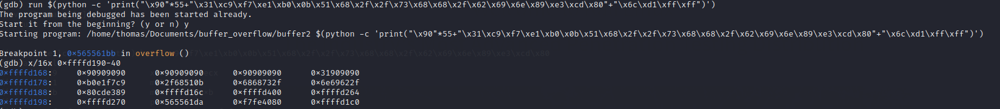
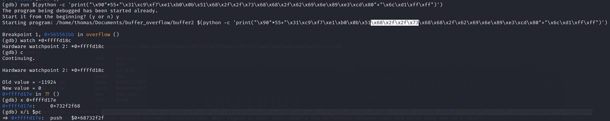
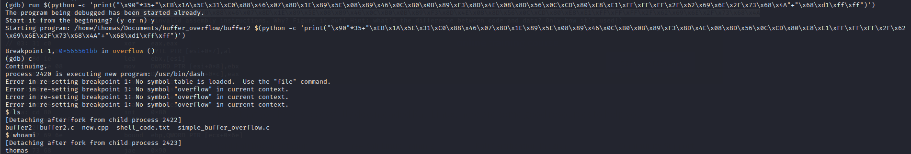

<p style="margin-top: 14px;"> Een buffer is een geheugen opslag die tijdelijk data vasthoud terwijl de data van de ene plek naar de andere
wordt overgezet. Een buffer overflow wordt veroorzaakt wanneer de volume van de data de geheugen opslag(buffer) overschrijdt.
Als gevolg hiervan wordt de data in meerdere geheugen opslagen overschreden.
</p>

### Uitleg
Een aanvaller kan een buffer overflow uitvoeren door het overschrijven van het geheugen van de applicatie.
Via het overschreden deel kan de aanvaller verschillende stukken schadelijke code uit voeren. Bijvoorbeeld kunnen ze nieuwe
instructies naar de applicatie sturen om toegang te krijgen tot het IT systeem.
<br /> <br />
Als aanvallers weten hoe het geheugen van de applicatie in elkaar steekt, kunnen ze gerichte aanvallen uitvoeren. 
Stel er is een bufer om in te loggen, deze verwacht gebruikersnaam en wachtwoord data van 8 bytes.
Als deze data niet met 8 bytes, maar met 10 bytes wordt verstuurd (2 meer dan verwacht). kan het programma deze data ergens anders buiten de buffer naartoe schrijven.
In deze 2 bytes kan de aanvaller dus schadelijke code zetten.

### Interesse
De reden waarom ik graag me wil verdiepen in buffer overflow aanvallen is, omdat ik dit heel vaak voorbij hoor komen. Het is een bekend aanvalsvector,
die mij erg interessant lijkt. In CSA ben ik hier al eerder mee bezig geweest, maar was het voor mij nog wel best vaag. <br />
Zo vind ik het hele proces en theorie achter buffer overflow vrij lastig en weet ik niet echt wat het in houdt en hoe ik dit kan uitvoeren.
Het lijkt mij persoonlijk erg leuk om met aspecten als geheugen aan de slag te gaan!
Ik hoop dan ook dat door het begrijpen en kunnen van een buffer overflow, ik mijn kennis en kunnen op het gebied van red teaming vergroot. 
Deze ervaring kan ik dna gebruiken in komende pentesten die ik dit en komende jaren ga uitvoeren.

### Youtube video's
- [Simple buffer overflow](https://www.youtube.com/watch?v=B4v56Ns3QhQ&ab_channel=JamesLyne)
- [Buffer overflow complex](https://www.youtube.com/watch?v=Rg_h-XIJ1c4&ab_channel=LiveOverflow)

### Buffer overflow eenvoudig
Om het idee achter een buffer overflow te begrijpen heb ik een simpel code geschreven in C. Deze code is gevoelig voor een buffer overflow,
 maar dit geeft mij wel een goed idee over hoe een buffer overflow in praktijk werkt.
 <br /> Het programma ziet er als volgt uit:<br />
 
 
 Deze code voert simpel weg een check uitof het wachtwoord(maximaal 16 bytes) gelijk is aan "password". Als dit het geval is wordt er een integer
 op '1' gezet en wordt er een gevoelig bestand uitgelezen. Maar als je een hacker mindset opzet denk je meteen, maar wat als ik meer dan 16 bytes meegeef?
 Exact dat is wat een buffer overflow veroorzaakt! Hieronder zie je dat ik dus inderdaad meer bytes meegeef dan het programma eigenlijk verwacht en wat
 er dan gebeurt is dat de overige bytes in andere buffers(in dit geval de *passcheck*) wordt opgeslagen. Deze variabele is dus gevuld en deze bijbehorende check
 zal dus voldoen, hierdoor wordt het bestand uitgelezen zonder enig wachtwoord. <br />
  
  
### Buffer overflow complex
Nu een complexere uitvoering van een buffer overflow, het is een eenvoudig script maar de uitvoering gaat in de diepte. Het programma is in C code geschreven,
over het algemeen zijn dergelijke programma's meer vatbaar voor buffer overflows. Echter, als invoer goed wordt afgevangen is er niks aan de hand.
Bij dit programma is dat niet het geval: <br />
<br />
Allereerst ben ik met de ```gdb``` (GNU Debugger) het programma ingedoken. Met deze debugger kan je het programma debuggen en kijken hoe het programma reageert op verschillende invoer, maar
wat vooral belangrijk is is hoe het geheugen daarmee omgaat.< br />
De code bevat verschillende methoden, *overflow* is daar één van. In deze methode zie je dat er gewerkt wordt met een buffer van 64 bytes. Het gevaar hierin is
dat deze invoer wordt gekopieerd in de buffer. Hieronder is te zien dat ik een breakpoint gezet heb na de functie van *overflow*. Dit heb ik gedaan om te zien wat er gebeurt
met het geheugen, nadat er een invoer is geweest bij het programma. <br />
<br />
Een logische stap is om nu te achterhalen waar de stack begint in het geheugen en hoeveel bytes je hebt tot het EIP(Extended Instruction Pointer).
Met de stack wordt de 'ruimte' in het geheugen bedoeld waar de data wordt opgeslagen. De EIP is get adres in de stack die de computer verteld waar in het geheugen
naar toe gegaan moet worden nadat er een commando uitgevoerd, dit bepaald de flow van het programma.
<br />
<br />
Om dit te kunnen vinden heb ik allereerst de code normaal uitgevoerd door 63 bytes te sturen(maximaal 64 geaccepteerd). Hierdoor stuit het programma
op de breakpoint, dat betekent dat het programma succesvol is uitgevoerd. In dit geval zou het geheugen veranderd moeten zijn. <br />
<br />
Door middel van het ``i frame`` commando, kunnen registers waar onder andere EIP in zit bekeken worden. Dit geeft weer dat het EIP zit op
``0xffffd19c``. Daarna haal ik het geheugen op rondom deze EIP en hier zie je dat de inderdaad veel ``41`` staan. Dit is de payload
die ik heb ingevoerd("A" is namelijk 41 in het geheugen).<br /> Op dit moment weet ik dus dat:
 - het EIP zit op **0xffffd19c**
 - Return adres **0xffffd168**, midden in de stack
 - de stack is 80 bytes groot (geel), want tot en met de payload is 62 bytes. Hier komen nog 18 bytes bij tot en met de EIP overschreven is (rood).
   
<br />


De kunst is nu om een payload te creëren die binnen het aantal bytes valt en de rest op te vullen met ``\x90``, de NOP. NOP Op internet heb ik een
payload gevonden die een reverse shell creëert naar het systeem. Deze shell code is als volgt: ``\x31\xc9\xf7\xe1\xb0\x0b\x51\x68\x2f\x2f\x73\x68\x68\x2f\x62\x69\x6e\x89\xe3\xcd\x80``.
Deze code is 21 bytes lang, het return adres (EIP) is 4 bytes en de NOP is het resterende dus 55 bytes. Waarom NOP? NOP staat voor No operation sled en dit 
is bedoeld om te "glijden" tot het volgende geheugen adres. Overal waar naar een NOP adres verwezen wordt, "glijdt" het totdat het bij de uit te voeren code komt( je payload).
<br />

Door middel van Python heb ik de exploit gemaakt en ga ik hem via de ``gdb`` versturen, ik verwacht dat ik hiermee een shell krijg.<br />

Helaas... dit werkt niet. Ik zet een ```watch``` om te kijken wat er mis gaat.<br />

Wat er dus gebeurd is dat de shell code zichzelf overschrijft, omdat het huidige geheugen van de shell code wordt verwijderd op het adres.
Om dit op te lossen heb ik een andere shell code gebruikt die niet afhankelijk is van het pushen naar het stack geheugen, namelijk: ``\xEB\x1A\x5E\x31\xC0\x88\x46\x07\x8D\x1E\x89\x5E\x08\x89\x46\x0C\xB0\x0B\x89\xF3\x8D\x4E\x08\x8D\x56\x0C\xCD\x80\xE8\xE1\xFF\xFF\xFF\x2F\x62\x69\x6E\x2F\x73\x68\x4A``.
Deze shell code is 41 bytes en wordt de NOP sled dus wat minder lang i.v.m. het verschil in byte lengte.<br />

Nu deze payload wordt verstuurd, zie je dat er een shell komt! Het werkt!

