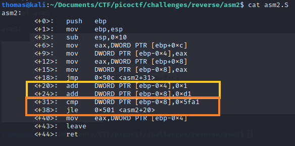

Om meer te oefenen met CTF uitdagingen en om in de toekomst meer eravring te hebben met CTF's, ben ik bezig met verschillende
CTF uitdagingen.

## Reverse engineering
Reverse engineering is een onderdeel wat me erg aanspreekt en hier vind ik veel uitdaging in. Ik ben begonnen met de vault-door challenges.
Dit zijn challenges voor beginnende reverse engineers. Deze challenges ging mij goed af en hier heb ik er dan ook al een paar van afgerond.


### Assembly language
Persoonlijk vond ik assembly language moeilijk om te lezen en te begrijpen. Wel leek het mij erg interessant en is het goed hier kennis over te hebben, voor
o.a. reverse engineering. Om hier mee te oefenen heb ik picoCTF challenges gedaan omtrent assembly en deze heb ik ook gehaald:


Deze challenges waren zeer leuk om te doen, om wat dieper in te gaan op een assembly challenge ga ik die asm2 uitleggen.

Deze challenge bood de volgende code:


> What does asm2(0x4,0x2d) return?

In het oranje gedeelte zie je een , ```cmp``` (compare) en een ```jle``` (jump less or equal) instructie.
Deze ``jle`` verwijst naar +20 en dat betekent dat we te maken hebben met een loop. 
Elke keer als de waarde van het address [ebp+0x8] is minder of gelijk aan 0x5fa1, springt de processor naar het gedeelte.
Hier wordt de waarde van het adres [ebp-0x4] verhoogd met 1 en de waarde van het adres [ebp+0x8] verhoogd met 0xd1. 
Na deze funtie is te zien dat de gereturnde waarde van het adres [ebp-0x4] op de stack wordt gezet. 

Hier kan een makkelijk python script voor worden geschreven die deze loop bevat en de return waarde geeft indien de condite voldoet:


