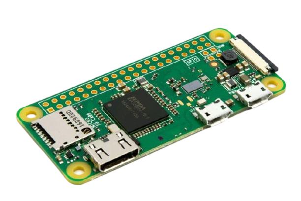

### Raspberry PI Zero W
Dit semester ga ik ook werken met een Raspberry PI Zero W. Voorafgaand had ik niet echt super veel ervaring met een Raspberry, ik ben dus erg benieuwd naar hoe het werkt en wat ik er allemaal mee kan doen.
<br/> Op 25'09'2020 heb ik een Raspberry Pi Zero W besteld bij [Kiwi Electronics](http://kiwi-electronics.nl/).


## Mogelijkheden
Met deze Raspberry Pi Zero W zijn er veel mogelijkheden wat betreft physical hacking, denk hierbij aan:
- Wachtwoord/hash stelen 
- Reverse shell
- Exfiltratie (van bestanden)

Er zijn nog oneindig veel andere mogelijkheden met een deze raspberry. Om deze vorm van hacken mogelijk te maken is [P4WNP1](https://github.com/RoganDawes/P4wnP1_aloa)
gebruikt.

## P4WNPI
P4wnP1 A.L.O.A. gemaakt door MaMe82 is een framework die een Rapsberry Pi Zero W veranderd in een flexible,
low-cost platform voor pentesten en red teaming … of in “A Little Offensive Appliance”.

De P4WNP1 maakt gebruik van (HID) scripts. Deze scripts bevatten payloads die kunnen worden uitgevoerd door de P4WNP1 en Rubber Dukcy.
De P4WNP1 zelf heeft veel mogelijkheden tot zich, zo kan je verbinden via een webinterface via bluetooth, USB en Wi-Fi.
Via de webinterface kan je de P4WNP1 helemaal naar je eigen zin inrichten. Zo kan je de hardware manipuleren en (een rits aan) scripts
uitvoeren. Die scripts kunnen o.b.v acties uitgevoerd worden, bijvoorbeeld als de Wi-Fi opgestart is of wanneer de P4WNP1 aan de host is verbonden.

Een aantal van interessante scripts ga ik uitvoeren, dit wordt in de onderstaande paragrafen besproken

## Covert channel
Een techniek die ik dit semester geleerd heb is reverse shells maken. Ook via een BadUSB kan een dergelijke shell gemaakt worden.
Echter, is dit niet zomaar een reverse shell, maar een covert shell. Dit een shell waarmee je kan communiceren ondanks het slachtoffer niet verbonden is met Wi-Fi!

In de onderstaande video zie je dat ik een enkele stappen/seconden een verborgen reverse shell opgezet heb. De connectie
tussen de P4WNP1 en het doelwit is langzaam, maar niet traceerbaar. Dit komt, omdat het via een covert W-Fi channel plaats vindt.
Via de P4WNP1 SSH shell kan ik via het ```screen``` commando de shell ophalen o.b.v. de sessie. 
<br />Hieronder zie je de executie van de code:
 <br />
Dit resulteert in een persistent reverse shell:
 <br /> <br />
Het enige nadeel is dat de P4WNP1 wel in de range van het doelwit moet zijn om de covert channel verbonden te houden.


## Exfiltratie Windows
Exfiltratie scripts zijn handig, voor hackers die bepaalde data willen verkrijgen van het slachtoffer. Deze data kan
zeer gevoelig zijn; denk aan configuratie - en backup bestanden, wachtwoorden of persoonlijke gegevens.

Om een dergelijke exfiltratie te doen, moet er gebruik worden gemaakt van een BadUSB. Dit is exact wat ik gedaan heb, de P4WNP1
wordt ingeplugd en alle bestanden worden erop gezet. Één nadeel is dat de hacker niet weet hoeveel bestanden het slachtoffer heeft, afhankelijk
hiervan kan het best wel even duren voordat de exfiltratie voltooid is. Wel kan de hacker aangeven wat voor type bestanden hij wil exfiltreren, dit kan de tijd reduceren.

Hieronder is een video van hoe een dergelijke exfiltratie van txt bestanden eruit ziet:

<video controls>
  <source src="../videos/exfil-win.webm" type="video/mp4">
  Your browser does not support the video tag.
</video>

## Dumpen Wi-Fi sleutels
Er is een script waarmee je alle plain-text wachtwoorden die ooit gebruikt zijn voor Wi-Fi's van het doelwit kan achterhalen.
Indien het doelwit bij de Wi-Fi op "vergeten" heeft gedrukt, dan zal dit niet kunnen worden achterhaald.

Als de hacker in kan loggen op de Wi-Fi kan die kijken wat er op dat netwerk gebeurd en wellicht kan hij daarmee (persoonlijke) data mee
onderscheppen.

Hieronder is een video te zien hoe dit met een BadUSB werkt:

<video controls>
  <source src="../videos/wifi-keys.webm" type="video/mp4">
  Your browser does not support the video tag.
</video>


