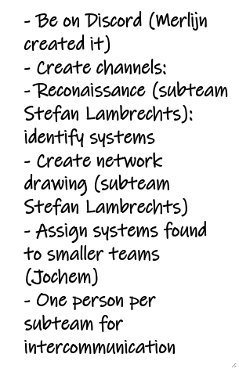

## Pentesten
In dit semester zullen er een aantal pentesten gedaan worden door mij. In dit hoofdstuk zal ik je meer vertellen over deze pentesten.

### R&D project
Voor het R&D project heb ik ook pentesten gedaan. Deze pentesten betreffen IOT omgevingen; zowel front-end, back-end en sensoren
zijn hierbij inbegrepen. Een dergelijke opdracht was de AirScrubber, dit is een applicatie die verschillende soorten stofdeeltjes in de lucht meet en
op basis daarvan zorgt dat de luchtkwaliteit beter wordt. Hij reinigt de lucht o.b.v. de data die uit de sensoren komen.

**AirScrubber** 
Deze applicatie heb ik deels mee gepentest, omdat er groepsgenoten waren die dit project als het ware "claimde". Ik heb wel de mogelijkheid
gehad op er ook naar te kijken, maar veel was allemaal al getest door andere groepsgenoten.
 Ik heb nog kunnen vinden dat:
- Er geen beveiliging zat op alle endpoints in de backend, als gebruiker met minder rechten kan je alle endpoints gebruiken. Dit moet wel met een geldig JWT token.
- Bij het aanmaken van sensoren, gebruikers en dergelijke kan je attributen weg/leeg laten en het systeem maakt het gewoon aan.
- De site op [security headers](https://securityheaders.com/) een dikke onvoldoende scoort!

Het afgeronde rapport is <a class="downloadlink" onClick="passwd('../files/Airscrubber-Report.docx','Rapportage Airscrubber')">hier</a> te zien.
  Aangezien wij als groep besloten hebben om de scope te vergroten en ook focus te leggen op andere IOT systemen, zal ik er hier ook een van opeisen.

**Smartwatch**

### Blue vs Red team 
Blue vs Red team evenementen zijn opgericht vanuit FHICT, deze zijn bedoeld om de vaardigheden van alle drie
de richtingen te testen/verbeteren. Zo worden de applicaties van de engineering studenten getest, de vaardigheden
van de red teamers(daar val ik onder) en de vaardigheden omtrent monitoring van de blueteamers.

#### Evenement 1
Ter voorbereiding op het eerste Blue vs Red team evenement is er een meeting geweest met alle red teamers.
Hierin zijn een aantal aspecten naar voren gekomen denk hierbij aan communicatie, verdelen in teams etc.: 

 
Dit was op het begin allemaal een beetje vaag, omdat niemand echt wist wat de bedoeling was.

Op de dag zelf heeft ons team een aantal applicaties toegewezen gekregen. Ik wilde graag meer leren en om die
reden heb ik aan Rick gevraagd om bij mij in het team te komen en te pentesten. Dit heeft hij gedaan en we hebben samen
deze pentesten uitgevoerd. 
Wat alleen erg jammer was, was dat zowat alle applicaties weinig functionaliteiten hadden. Dit komt ook, omdat
het pas de eerste fase 1 is van het semester. Dit vond ik persoonlijk erg jammer, want ik keek er erg naar uit.

Toch hebben we het een en ander geprobeerd op de applicaties, denk hierbij aan dingen als:
- schadelijke bestanden uploaden
- input filtering
- rol bypassing 
- encryption testen
- XSS

Hier kwam niet veel uit, ondanks dat we op 1 applicatie hadden gevonden dat er geen rollensysteem werd gebruikt.
Ik kon zo inloggen als admin, terwijl er ook een gebruikersrol zou moeten zijn. Hiermee konden wij items in deze
webshop aanmaken, die niet helemaal legitiem waren. Echter, werden deze bestanden wel toegevoegd alleen deed de back - en front-end er niks mee.

De betreffende rapporten zijn hier te vinden:
- <a href="../files/rtvsbt/Report-Blogging-Website.docx" download>Blogging website</a>
- <a href="../files/rtvsbt/Report-Reading-Website.docx" download>Reading website</a>
- <a href="../files/rtvsbt/Report-Webshop.docx" download>Webshop website</a>

Aangezien ik het jammer vond dat hier niks in te vinden was en ik nog tijd over had ben ik met de applicatie 
van een vriend van mijn bezig geweest. Deze applicatie had daarentegen wel een aantal bugs, denk hierbij aan missende
authenticatie, slechte error afhandeling, input filtering en onnodige logging. Ik had er niet extreem veel tijd
voor, maar in die tijd heb ik wel veel kunnen vinden! 
Het rapport is <a href="../files/rtvsbt/Report-Internetbankieren-Marc_V_Bommel.docx" download>hier</a> in te zien.
  De maker van deze applicatie was erg blij met het document en vond het document heel duidelijk.

### Citrus Andriessen
Vanuit school is ons de mogelijkheid geboden om een pentest uit te voeren bij een bestaand bedrijf. We konden kiezen
uit verschillende bedrijven, maar uiteindelijk leek mij [Citrus Andriessen](https://www.citrusandriessen.nl/) het leukste. Deze pentest mocht gedaan worden
met meerdere personen en mijn leden zijn geworden: [Anouk Brondijk]() en [Joël Adams](https://joeladams.nl). Samen gaan wij deze pentest verzorgen en maken hier een mooi project van!
  
Ik heb mezelf aangewezen als 'leider' en ben contact op gaan nemen met het bedrijf(5-10-2020). Deze gaven geen reactie en toen ben ik via het contactformulier op de site
een e-mail gaan schrijven. Deze e-mail heeft er wel toe geleid dat er reactie kwam vanuit ons contactpersoon(27-10-2020). Vanuit hier gaan we een Teams meeting inplannen om het een en ander te bespreken.
 
