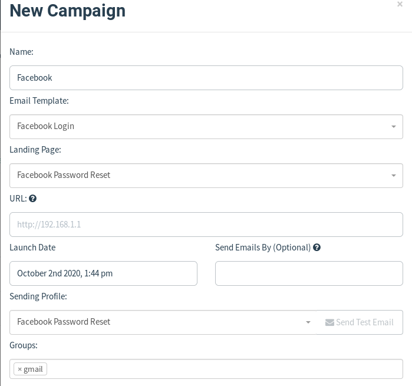
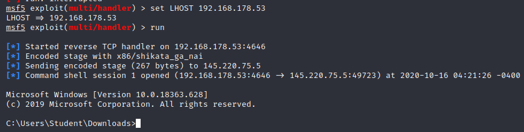
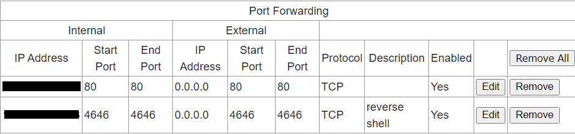

<p style="margin-top: 14px;">Phishing is een vorm van digitale oplichting. Dit gaat vaak via via e-mail, WhatsApp of sms. 
Slachtoffers worden vaak misleidt en gaan ze naar een valse website waar ze hun bank- of andere persoonlijke inloggegevens prijsgeven. 
Of ze maken zelfs een bedrag over naar een fraudeur die zich voordoet als bijvoorbeeld familie. 
Hoe kan dit gereproduceerd worden en wat kunt u er zelf tegen doen om deze vorm van oplichting te vinden en voorkomen?
</p>

<p style="margin-top: 110px;"></p>Om de basis van phishing te begrijpen en kunnen heb ik gewerkt met [GoPhish](https://getgophish.com/). GoPhish is een handige tool om zelf phishing mails op te stellen.
Deze tooling is gekozen, omdat het een handige (web)interface heeft; via deze interface kan je gemakkelijk onderdelen configuren, zoals:
- E-mail (zonder of met template, e-mail headers)
- De phishing pagina (bestaande importeren of zelf maken)
- Ontvangers (met de optie voor een "test e-mail")

### Basis
Zoals eerder gezegd heb ik dus voor de tooling GoPhish gekozen, hoe ik deze tooling heb gebruikt om phishingmails te configureren
en te versturen staat hieronder uitgelegd:<br />

**Stap 1**<br />
Allereerst heb ik GoPhish gedownload via het commando ``go get github.com/gophish/gophish``. 
Als je in de map gaat waar het gedownload is bevindt zich een bestand genaamd ***gophish***, voor deze uit door: ```./gophish```
in te voeren. In de terminal krijg je te zien dat GoPhish opstart en je hem kan bereiken op http://127.0.0.1:3333. <br /> 


**Stap 2**<br />
Hierna heb ik de User Groups aangemaakt in de webinterface. De User en Groups zijn eigenlijk de daadwerkelijke ontvangers van de phishing mail.
De ontvanger(s) is in dit geval mijn eigen gmail om te kunnen testen dat deze aankomt.


**Stap 3**<br />
Stap 3 is de stap waarin de "Landing page" wordt gemaakt, ook wel de phishing site genoemd. Deze site is de site waar het slachtoffer
op kan klikken in de e-mail, echter is dit dus de phishing site. Om dit zo echt mogelijk te laten lijken ben ik gegaan voor Facebook. Waarom ik hiervoor gekozen hebt wordt in
de volgende stap duidelijk gemaakt. <br /> 
Hieronder is de (geïmporteerde) phishing website te zien:


**Stap 4**<br />
De e-mail die ik zelf gemaakt heb is een e-mail die hoort bij de "Landing page". Het scenario hiervan is als volgt:
Het slachtoffer krijgt een e-mail binnen waarin staat dat er een recente inlogpoging is geweest op zijn/haar Facebook account. 
Het slachtoffer schiet hierbij in paniek en gaat naar de aangegeven ondersteuningswebsite om het wachtwoord te wijzigen. Echter, moet 
diegene hier wel voor ingelogd zijn. Daardoor komt de slachtoffer op de inlogpagina zoals in stap 3 te zien is en vult uit paniek 
zijn/haar gegevens in en vóila de gegevens komen in GoPhish tevoorschijn.


**Stap 5**<br />
Om een e-mail te kunnen verzenden moet er wel eerst een server worden opgezet om vanuit te kunnen versturen.
Deze server heb ik via [mailtrap](https://mailtrap.io/) opgezet. Hierin komen alle mailtjes die ik verstuur naar voren, daarin kan ik
ook zien wat de headers, spam rate enzovoort is.

**Stap 6**<br />
Om de definitieve mail te kunnen versturen moet de "Campaign" aangemaakt worden. De Campaign zorgt ervoor dat
de e-mail wordt verstuurd met alle bij behorende configuraties. Via deze Campaign kunnen allerlei resultaten van de phishing mail bekeken worden.
Hieronder is te zien hoe de Campaign gemaakt kan worden, De URL is de url waar de slachtoffer naartoe wordt gestuurd.


**Resultaat**<br />
Alle gegevens omtrent de e-mail kunnen bekeken worden in de Campaign. Hieronder is te zien hoe het resultaat is als de data gesubmit is:

Zoals je ziet kan je ook live volgen of het slachtoffer de e-mail geopend heeft, de link geklikt heeft, gegevens heeft ingevuld etc.

***Notitie***<br />
Wat betreft de URL bij het aanmaken van de Campaign, heb ik de URL van mijn router gebruikt. Hierin heb ik dus een rule toegevoegd
voor een port forwarding voor mijn VM.

### Geavanceerd
Ter verbetering van de phishing mail zou het mooi zijn als:
- Het lukt om de spam filter te bypassen
- Dat het slachtoffer op basis van de bron van de e-mail niks verdachts ziet.
- Dat de phishing URL aangepast kan worden naar een daadwerkelijke URL i.p.v. een IP-adres

**Bypass filter** <br />
Het is gelukt om de filter te bypassen en mijn phishing mail in de inbox te krijgen, van notabene gmail:


Bovendien heb ik de phishing mail verbeterd en ziet deze er nu zo uit:


Echter, is het niet mogelijk om het Message-Id en de From e-mail headers aan te passen, zodat dit niet verdacht is. Hieronder
kan je zien dat er namelijk in de bron van de e-mail staat dat het vanuit een kali machine verstuurd is d.m.v. GoPhish:


### Bussiness Case
Ik heb onderzoek gedaan naar de disclaimer of breed gezegd de *Business case* van GoPhish. Nergens kreeg ik gevonden
wat zij nou eigenlijk met de data doen die ik gekregen heb. Als voorbeeld, ik stuur een phishing mail naar me ouders voor het achterhalen van credentials.
Zij vullen dit goed in, dus deze gegevens zijn legit, hoe weet ik dan dat GoPhish deze niet opslaat ergens om er vervolgens wellicht misbruik van te maken.
Aangezien ik dit nergens kon vinden, ben ik de tooling minder gaan vertrouwen. Ik heb wel een alternatief kunnen vinden, namelijk [SET (Social-Engineering toolkit)](https://www.social-engineer.org/framework/se-tools/computer-based/social-engineer-toolkit-set/). 
Deze tooling ligt helemaal in eigen hand, je bent hierbij dus niet afhankelijk van een derde partij(zoals GoPhish). Hier ben ik dan ook zeker van dat mijn gegevens ook **echt** bij 
mij blijven.

### Video's
- [PDF payload creation](https://www.youtube.com/watch?v=rfsRFEfae_Y&ab_channel=RootSploit)
- [EXE in PDF](https://www.youtube.com/watch?v=zCzk1nM0jnc&ab_channel=TechnoScience)

### SET
Het Social Engineering Framework is een informatiebron voor mensen die meer willen weten over de psychologische, fysieke en historische aspecten van social engineering.
Je kan via deze command-line tool zelf deze aspecten uitproberen en oefenen.
<br />
<br />
Ik heb geprobeerd via SET een phishing e-mail te sturen met een PDF(wat dus eigenlijk een pdf.exe was) als payload bijlage. Dit werkte niet zoals verwacht, omdat gmail een dergelijke bijlage niet accepteerde (.exe).
Om die reden heb ik via een tutorial(eerste in de video lijst) een PDF payload kunnen maken om te kunnen sturen als bijlage.

Allereerst heb ik script gemaakt via [autoit](https://www.autoitscript.com/site/), dit programma biedt de mogelijkheid om een executable te maken die in Windows(slachtoffer) gerund kan worden.
Dit script ziet er als volgt uit:<br />


In dit script moet dan worden aangegeven wat de host is waarop geluisterd wordt en wat de payload is, dit gebeurt via het [shellter](https://www.shellterproject.com/) programma:


De URL die in het script te zien is een PDF, deze PDF is een bestand die wordt geopend in de browser. Deze PDF moet dus een bestand zijn die de lezer aanspreekt, want waarom
zou je hem anders downloaden? In dit geval heb ik gekozen voor de richting "investeren":


In deze PDF zit dus stiekem een executable die op de achtergrond wordt uitgevoerd als de slachtoffer hem opent. Zodra deze gedownload is door de slachtoffer ziet hij 
het volgende in de verkenner:<br />


Dit bestand is gemaakt middels de tweede video in het vorige kopstuk. Hiermee kon ik van een executable en een image een combinatie maken. Deze combinatie leidde tot 
het bovenstaande bestand. Dit bestand is een pdf met daarin dus de executable, helaas kreeg ik ook deze niet via gmail.. Wel komt er een rootshell uit voort als de
slachtoffer het bestand opent, zie onderstaande afbeelding.



<br />


Helaas blokte gmail al mijn pogingen.. Mijn e-mail heb ik ook via een SMTP server weten te versturen, hierin zag je wel de e-mail staan. Als ik deze server open op de Windows
machine en de e-mail bekijk, kan ik wel het bestand uitvoeren wat leidt tot een shell. 


<br />
De SMTP server:
<br />


### Netwerk tekening + uitleg
Ter verduidelijking van het phishing project, heb ik er een netwerk diagram bij gemaakt:

<br />
In de diagram is te zien dat de aanvaller (ik) een kali linux machine heeft waarop een GoPhish server draait. 
Hier maakt de aanvaller dan een pagina aan die dient als de phishing site, deze staat dan op de GoPhish server.
Om ervoor te zorgen dat het slachtoffer bij deze site kan, wordt poort 80 van de kali linux machine geforward.
Als er dus ene request wordt gemaakt naar het IP-adres van de router, wordt er doorverwezen naar die van de kali linux machine. Bovendien is er een regel in de router
die ervoor zorgt dat er een reverse shell opgezet kan worden. De request naar de router wordt dan doorverwezen naar de poort van mijn kali linux machine.
<br />
<br />
De regels in de router zijn hieronder te zien:


### Ouders
Mijn ouders ga ik testen met een phishing mail, die hier uiteraard niks van af weten. Op deze manier kan ik testen hoe mijn e-mail
functioneert, hoe echt hij lijkt en hoe "aware" mijn ouders zijn op dit gebied.

De phishing mail die ik gestuurd heb was degene van het verlopen FaceBook wachtwoord. Zowel mijn moeder als vader kwamen naar mij toe om 
aan mij te vragen of dit echt of nep was. Toen heb ik aangegeven dat het inderdaad een phishing mail was om hen te testen. Ze gaven hierbij aan
dat de phishing mail zelf goed en geloofwaardig eruit zag, alleen voelden ze zich nog niet genoodzaakt genoeg om gegevens in te vullen.

Deze leermomenten neem ik mee voor de volgende phishing poging!

### Citrus Andriessen
[Citrus Andriessen](https://www.citrusandriessen.nl/) is een bedrijf die organisaties helpt bij de overstap van papier naar digitaal of het optimaliseren van je bestaande digitale toetsing.
Dit bedrijf hebben wij gekozen om te gaan pentesten, hierin is naast webapplicaties testen ook phishing uitgevoerd op de organisatie.

Ter voorbereiding op de phishing mail zijn wij eerst een OSINT gaan doen. Hierin hebben wij onder andere gezocht naar de mederwerkers, functies, vacatures etc.
Hiermee konden wij dus inschatten welke medewerker een goed slachtoffer zou zijn voor een phishing mail. 

Hiervoor moet eerst onderzoek gedaan worden naar hoe wij de phishing mail gaan opstellen, het doel moet namelijk
zijn dat het slachtoffer zich genoodzaakt voelt om bijvoorbeeld op een link te klikken en gegevens in te vullen. Naar alle sites te hebben doorzocht zijn wij tot de conclusie gekomen
dat de phishing mail zihc focust op de WordPress van de organisatie zelf. Het doel van de mail zal worden dat het wachtwoordbeleid van WordPress wordt aangepast en het bestaande wachtwoord gewijzigd dient te worden.
Indien dit niet gedaan zal worden, wordt het account geblokkeerd. De mail ziet er als volgt uit:


Nu we de phishing mail hebben en de e-mail adressen van de slachtoffers hebben ontbreekt er nog een ding, de phishing site.
Het doel van deze phishing site is om het slachtoffer het oude wachtwoord van, een door de pentest naar voren gekomen username, te weten te komen. De phishing website zelf
is gehost via fhict. Voor deze website heb ik een certificaat aangemaakt waardoor er een HTTPS verbinding is, dit vergroot de betrouwbaarheid. Bovendien heb ik ook
nog een domein aangevraagd zoals te zien is in de link van de phising mail. Op deze manier zijn alle verdachte aspecten weggewerkt en lijkt dit net echt, alleen staat er niet ```.nl``` maar ```.ml```.
De fake website zit er als volgt uit:


De resultaten van de phishing mail waren er niet, maar er zijn wel heel veel slachtoffers die twijfelde aan de phishing mail. Deze mensen stuurde
de email door naar hun leidinggevende en dat was onze opdrachtgever. In dit geval hadden wij eigenlijk het beste onze opdrachtgever kunnen phishen, maar hij wist er natuurlijk al van af.

Hier zie je een e-mail van een twijfelaar:


Ondanks dat niemand er in is getrapt heb ik hier wel veel van geleerd en neem ik alle leermomenten mee naar de volgende keer. Hopelijk heb ik 
dan meer succes met het phishen.

### Advies
Om te zorgen dat je niet in dergelijke phishing e-mails trapt zijn heb ik wat aandachtspunten geformuleerd:
- Ga nooit via een link in een e-mail naar de website voor uw persoonlijke gegevens
- Reageer nooit meteen op een dergelijke e-mail, criminelen gaan uit van een schokreactie
- Twijfel je? Meld het!
- Controleer de bron van de e-mail
- Controleer of de URL van de link in de e-mail niet verdacht is.

Hierdoor voorkom je dat je het slachtoffer wordt van een phishingmail. 100% beschermt ben je nooit, maar gebruik ten alle tijden je
gezond verstand!

