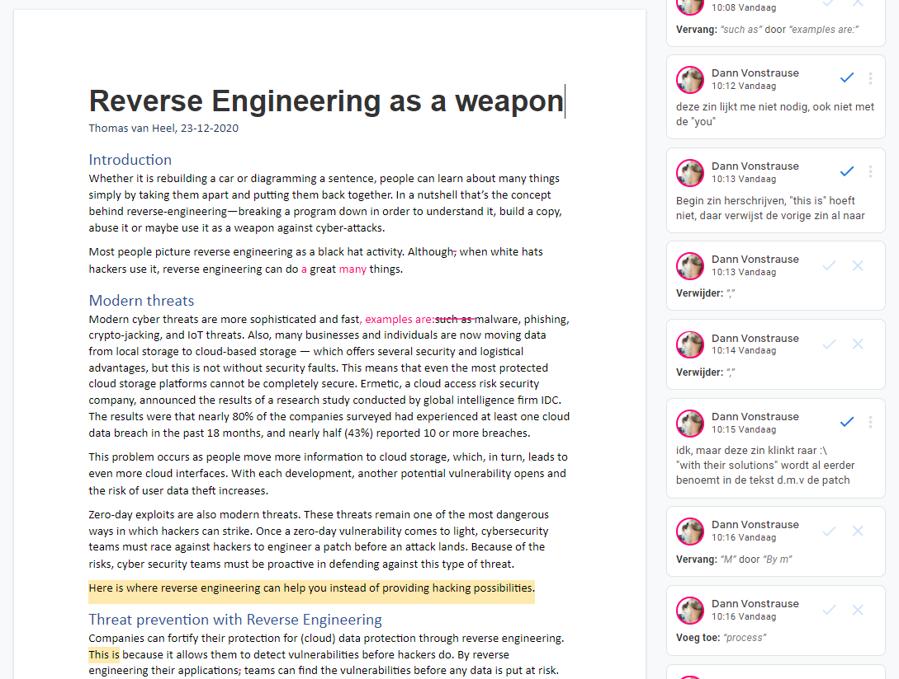

# Artikel
Vanuit school hebben wij een workshop gehad omtrent het schrijven van een artikel. 
Nu was het de bedoeling dat alle groepsleden een artikel moesten schrijven omtrent een cyber security gerelateerd onderwerp.
Van deze artikelen zou er één gekozen gaan worden voor het symposium, deze zal door de groep uitgekozen worden.

Zelf heb ik gekozen om een artikel te schrijven over Reverse Engineering. Dit heb ik gedaan, omdat ik tijdens deze
minor hier geïnteresseerd ben geraakt. Aangezien dit onderwerp mij aanspreekt, leek het me een goed idee hier een artikel
over te schrijven. Dit onderwerp heeft geen betrekking tot het R&D project.

## Het Artikel 
Allereerst ben ik begonnen met het nadenken over:
- Een aantrekkelijke titel
- De verschillende kopstukken
- De inhoud in steekwoorden
- De schrijfstijl

Toen dit duidelijk is, ben ik daadwerkelijk mijn artikel gaan schrijven. Aangezien mijn schrijfstijl in het engels
af en toe 'vertaald' voelt heb ik hier extra aandacht aan besteed. Verder heb ik het laten reviewen naar twee groepsgenoten, Joel en Marc. 
Bovendien heeft er ook een buitenstaander, een kennis, dit artikel door gelezen en feedback gegeven.
Een voorbeeld van de feedback is hieronder te zien:
{:}

Verder heb ik aan de reviewers gevraagd wat zij van het artikel vonden en die gaven aan dat het, op de feedbackpunten na, een
goed inhoudelijk artikel is. Vooral vonden ze de conclusie sterk naar voren komen.
