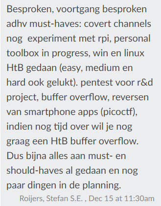

Na de half-way individuele oplevering ben ik erachter gekomen dat Stefan Roijers mijn vakdocent is i.p.v. Tom Broumels.
Dit is mijn fout geweest aangezien ik er eigenlijk vanuit ging dagt Tom Broumels alle redteamers deed begeleiden. Echter, aangezien dit er te veel waren
heeft Stefan er een paar op zich genomen, waaronder mij. 

Samen met Stefan zal ik verder momenten afspreken voor feedback i.p.v. met Tom Broumels, zodat hij een goed beeld heeft van hou ik ervoor sta en wat er nog gedaan moet worden.

### Moment 1
Tijdens het eerste moment met Stefan heb ik gepraat over mijn doelen en activiteiten tot nu toe. Hier was hij erg enthousiast over en vind het leuk
om te zien dat ik dingen doe naar mijn eigen interesse.

### Moment 2
15'11'2020 heb ik een feedback moment gehad met Stefan Roijers, mijn vakdocent. Hierin hebben we mijn leerplanning, activiteiten en doelen bekeken.
De feedback die ik van hem heb ontvangen is hieronder te zien:  

 

Hier was ik tevreden over en ga me vol focussen op de laatste aspecten die ik nog wil gaan doen.
Bovendien zal ik mijn portfolio zelf nog professionaliseren en verduidelijken.
