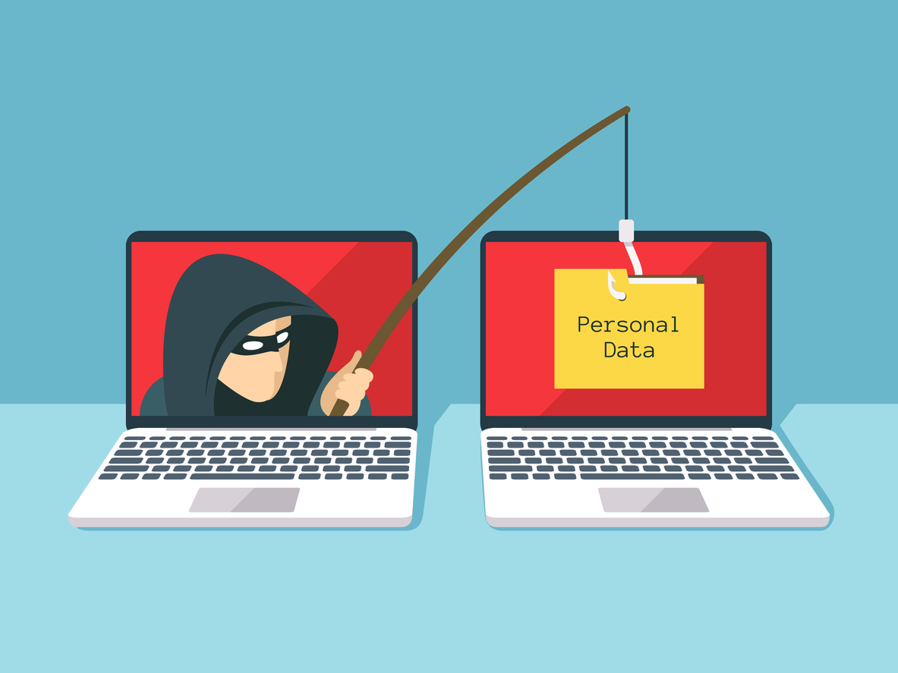
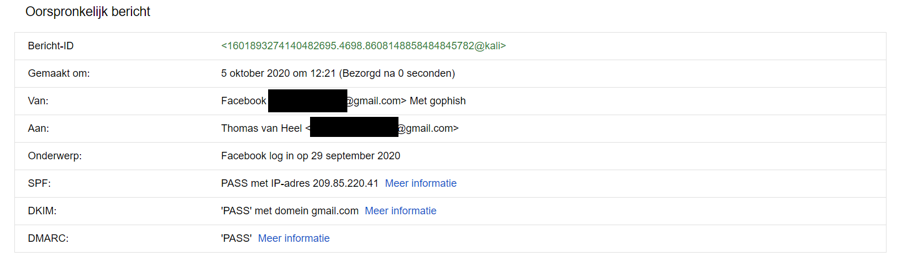

<p style="margin-top: 14px;">Phishing is een vorm van digitale oplichting. Dit gaat vaak via via e-mail, WhatsApp of sms. 
Slachtoffers worden vaak misleidt en gaan ze naar een valse website waar ze hun bank- of andere persoonlijke inloggegevens prijsgeven. 
Of ze maken zelfs een bedrag over naar een fraudeur die zich voordoet als bijvoorbeeld familie. 
Hoe kan dit gereproduceerd worden en wat kunt u er zelf tegen doen om deze vorm van oplichting te vinden en voorkomen?
</p>

<p style="margin-top: 110px;"></p>Om de basis van phishing te begrijpen en kunnen heb ik gewerkt met [GoPhish](https://getgophish.com/). GoPhish is een handige tool om zelf phishing mails op te stellen.
Deze tooling is gekozen, omdat het een handige (web)interface heeft; via deze interface kan je gemakkelijk onderdelen configuren, zoals:
- E-mail (zonder of met template, e-mail headers)
- De phishing pagina (bestaande importeren of zelf maken)
- Ontvangers (met de optie voor een "test e-mail")

### Bussiness Case

### Basis
Zoals eerder gezegd heb ik dus voor de tooling GoPhish gekozen, hoe ik deze tooling heb gebruikt om phishingmails te configureren
en te versturen staat hieronder uitgelegd:<br />

**Stap 1**<br />
Allereerst heb ik GoPhish gedownload via het commando ``go get github.com/gophish/gophish``. 
Als je in de map gaat waar het gedownload is bevindt zich een bestand genaamd ***gophish***, voor deze uit door: ```./gophish```
in te voeren. In de terminal krijg je te zien dat GoPhish opstart en je hem kan bereiken op http://127.0.0.1:3333. <br /> 


**Stap 2**<br />
Hierna heb ik de User Groups aangemaakt in de webinterface. De User en Groups zijn eigenlijk de daadwerkelijke ontvangers van de phishing mail.
De ontvanger(s) is in dit geval mijn eigen gmail om te kunnen testen dat deze aankomt.


**Stap 3**<br />
Stap 3 is de stap waarin de "Landing page" wordt gemaakt, ook wel de phishing site genoemd. Deze site is de site waar het slachtoffer
op kan klikken in de e-mail, echter is dit dus de phishing site. Om dit zo echt mogelijk te laten lijken ben ik gegaan voor Facebook. Waarom ik hiervoor gekozen hebt wordt in
de volgende stap duidelijk gemaakt. <br /> 
Hieronder is de (geïmporteerde) phishing website te zien:


**Stap 4**<br />
De e-mail die ik zelf gemaakt heb is een e-mail die hoort bij de "Landing page". Het scenario hiervan is als volgt:
Het slachtoffer krijgt een e-mail binnen waarin staat dat er een recente inlogpoging is geweest op zijn/haar Facebook account. 
Het slachtoffer schiet hierbij in paniek en gaat naar de aangegeven ondersteuningswebsite om het wachtwoord te wijzigen. Echter, moet 
diegene hier wel voor ingelogd zijn. Daardoor komt de slachtoffer op de inlogpagina zoals in stap 3 te zien is en vult uit paniek 
zijn/haar gegevens in en vóila de gegevens komen in GoPhish tevoorschijn.


**Stap 5**<br />
Om een e-mail te kunnen verzenden moet er wel eerst een server worden opgezet om vanuit te kunnen versturen.
Deze server heb ik via [mailtrap](https://mailtrap.io/) opgezet. Hierin komen alle mailtjes die ik verstuur naar voren, daarin kan ik
ook zien wat de headers, spam rate enzovoort is.

**Stap 6**<br />
Om de definitieve mail te kunnen versturen moet de "Campaign" aangemaakt worden. De Campaign zorgt ervoor dat
de e-mail wordt verstuurd met alle bij behorende configuraties. Via deze Campaign kunnen allerlei resultaten van de phishing mail bekeken worden.
Hieronder is te zien hoe de Campaign gemaakt kan worden, De URL is de url waar de slachtoffer naartoe wordt gestuurd.


**Resultaat**<br />
Alle gegevens omtrent de e-mail kunnen bekeken worden in de Campaign. Hieronder is te zien hoe het resultaat is als de data gesubmit is:

Zoals je ziet kan je ook live volgen of het slachtoffer de e-mail geopend heeft, de link geklikt heeft, gegevens heeft ingevuld etc.

***Notitie***<br />
Wat betreft de URL bij het aanmaken van de Campaign, heb ik de URL van mijn router gebruikt. Hierin heb ik dus een rule toegevoegd
voor een port forwarding voor mijn VM.

### Geavanceerd
Ter verbetering van de phishing mail zou het mooi zijn als:
- Het lukt om de spam filter te bypassen
- Dat het slachtoffer op basis van de bron van de e-mail niks verdachts ziet.
- Dat de phishing URL aangepast kan worden naar een daadwerkelijke URL i.p.v. een IP-adres

**Bypass filter** <br />
Het is gelukt om de filter te bypassen en mijn phishing mail in de inbox te krijgen, van notabene gmail:


Bovendien heb ik de phishing mail verbeterd en ziet deze er nu zo uit:


Echter, is het niet mogelijk om het Message-Id en de From e-mail headers aan te passen, zodat dit niet verdacht is. Hieronder
kan je zien dat er namelijk in de bron van de e-mail staat dat het vanuit een kali machine verstuurd is d.m.v. GoPhish:


### Ouders
De bovenstaande e-mail ga ik testen bij mijn ouders, die hier uiteraard niks van af weten. Op deze manier kan ik testen hoe mijn e-mail
functioneert, hoe echt hij lijkt en hoe "aware" mijn ouders zijn op dit gebied. <br />
                                                                                <br />
                                                                                Coming soon...
### Citrus Andriessen
[Citrus Andriessen](https://www.citrusandriessen.nl/) is een bedrijf die organisaties helpt bij de overstap van papier naar digitaal of het optimaliseren van je bestaande digitale toetsing.
Dit bedrijf hebben wij gekozen om te gaan pentesten, hierin kan naast webapplicaties testen misschien ook andere testen gedaan worden. Denk hierbij
aan Social Engineering of Phishing, dat laaste wil ik graag gaan proberen om de medewerker(s) van dit bedrijf te testen.<br />
<br />
Coming soon...

### Advies
Om te zorgen dat je niet in dergelijke phishing e-mails trapt zijn heb ik wat aandachtspunten geformuleerd:
- Ga nooit via een link in een e-mail naar de website voor uw persoonlijke gegevens
- Reageer nooit meteen op een dergelijke e-mail, criminelen gaan uit van een schokreactie
- Twijfelt je? Meld het!
- Controleer de bron van de e-mail
- Controleer of de URL van de link in de e-mail niet verdacht is.

Hierdoor voorkom je dat je het slachtoffer wordt van een phishingmail. 100% beschermt ben je nooit, maar gebruik ten alle tijden je
gezond verstand!

