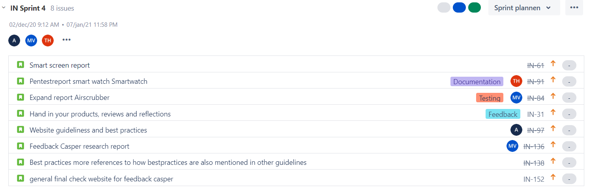
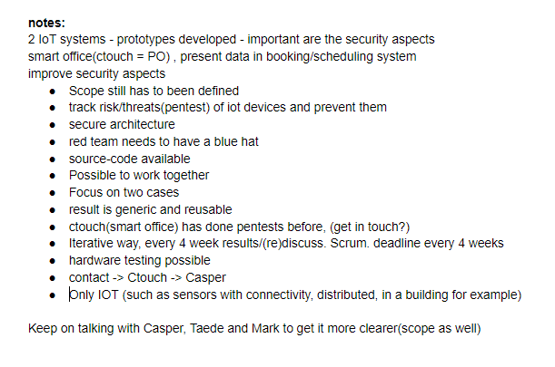

# Rollen
Tijdens het R&D project is er via een Agile manier gewerkt, namelijk [Scrum](https://agilescrumgroup.nl/wat-is-scrum-methode/).
Het idee van scrum is dat het team is ingedeeld is in verschillende rollen. Zo zijn er rollen als: scrum master, product owner en developers. Verder
zijn er rollen die wij als groep onderling verdeeld hebben per sprint, notaris is daar één van. Over de rollen die ik uitgevoerd heb
zal dieper worden in gegaan over wat het is en hoe ik dit gedaan en ervaren heb.

### Scrum master
De Scrum Master is verantwoordelijk voor het op correcte wijze uitvoeren van de Scrum aanpak.
Dit wordt gedaan door ervoor te zorgen dat het hele team de Scrum theorie, werkwijzen en regels naleeft.

Dit zijn de belangrijkste Scrum Master taken:
- Zorgen dat elke stap van een Scrum project doorlopen wordt.
- Eventuele belemmeringen tijdens het project oplossen of uit de weg gaan.
- Zorgen dat iedereen begrijpt wat er gedaan moet worden en waarom.

De tweede sprint ben ik begonnen met het vervullen van de functie scrum master. Dit was een rol die ik nog nooit eerder gedaan had, maar het is 
iets wat ik graag wilde leren. Dit ook, omdat mijn leiderschap vaardigheden niet altijd goed zijn. Tijdens deze sprints heb ik elke projectdag
ervoor gezorgd dat er een stand-up was. Hierin werd dan besproken wat er op het Scrum board staat, wat moet er gedaan worden en waarom. 
Mochten er problemen zijn of extra onvoorspelde taken voegde ik dit toe in een sprint gekeken naar de velocity. Verder heb ik planningpoker georganiseerd om
te achterhalen hoeveel en welke issues er in de sprint gezet konden worden. Verder heb ik samen met de projectleider belemmeringen in het project opgelost
indien deze zich voordeden. Elke dag heb ik mensen aan hun tand gevoeld om te kijken wat ze aan het doen zijn, want vaak als ze klaar zijn met de issue gaan
ze iets voor zichzelf doen. Als laatste heb ik ook nog gekeken of elke stap in het scrum proces wordt doorlopen.

Aangezien ik niet kan terug kijken in vorige sprints via Jira, heb ik hier een voorbeeld van een door mij ingerichte sprint:  
{: class="normal_img"}  

Hierin is ook te zien dat aspecten als feedback van Casper in de sprint staan, berekend door mij leek het mij haalbaar dit in deze sprint te doen.

Hoe mijn groepsgenoten mij hebben ervaren was vrij positief. Het was voor mij de eerste keer als scrum master dus was er veel ook wennen. Ook, omdat
ik nooit echt een leider ben geweest ergens in. Meestal doe ik gewoon wat mij gevraagd wordt. In de peerreviews is ook terug te zien wat zij ervan
vonden. 
Zelf vond ik het een goed ervaring en leermoment. Ik heb er veel van op gestoken en denk dat ik dit vaker ga doen aangezien mijn groepsgenoten dit
ook fijn vonden. Wat ik beter kon doen was een meer actieve rol nemen, omdat Merlijn mij wel is overnam. Dit deed hij aangezien hij de groepsleider was
en dit voor mijn gevoel wel is verwarde met de rol scrum master. Dit sluit ook aan op het leerdoel voor volgend semester: mijn mening uiten. Verder 
moet ik meer in de gaten houden of er issues zijn die niet meer gebruikt worden, hierdoor wordt het nog overzichtelijker.

### Notaris
De notaris is verantwoordelijk voor het bijhouden van de notities van gesprekken met bijvoorbeeld stakeholders, docenten of gewoon groepsgenoten
onder elkaar.

De eerste sprint ben ik begonnen met de rol notaris. Dit was een rol die wel vaker gedaan heb en mij goed in de vingers ligt. Mijn notities zijn
vaak duidelijk en kort maar krachtig. Het lukt mij om de meest belangrijke punten uit een gesprek te halen. Een voorbeeld van een notitie is hier te zien:  
{: class="normal_img"}  

Deze notitie ging over de kick-off van INTERSECT, deze was zeer belangrijk. Dit was vooral, omdat het project voor onze groep nog vaag was en wij niet echt wisten
wat we exact moesten doen. Om die reden was deze notitie erg cruciaal, zodat wij konden terug kijken wat ze exact van ons verwachtten.

Mijn groepsgenoten waren tevreden over de notities die ik gemaakt heb, onder andere ook deze. Ze hadden hier geen commentaar over en het was
voor hen duidelijk wat de kernpunten waren van het gesprek. Verder vind ik notaris niet erg om te doen en bevalt het mij wel. Dit zorgt er ook voor
dat je tijdens gesprekken alerter bent dan dat je dit was zonder een dergelijke rol. Het had dus veel positieve kanten en in de toekomst zou ik 
nog vaker willen doen, zo kan ik beter en beter worden.