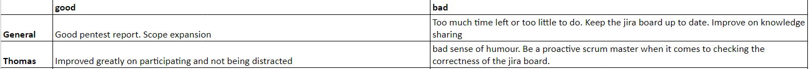

### Taken
Mijn taak tijdens deze sprint was om mee te werken aan de pentest voor het Airscrubber project en hierbij een rapportage te maken. Deze rapportage 
heb ik gemaakt met meerdere studenten, maar hier heb ik wel het voortouw in genomen.
  Tijdens de pentest heb ik de volgende dingen (mee) gevonden die benoemingswaardig zijn:
- Geen beveiliging op alle endpoints in de backend, als gebruiker met minder rechten kan je alle endpoints gebruiken. Dit moet wel met een geldig JWT token.
- Er zitten geen checks in de hele applicatie, vaak krijg je errors of erger nog. Er zit netjes een check of je een geldig JWT token hebt, **maar** niet bij wat voor
rol dit hoort. Je kan dus alles met een gebruiker doen wat een administrator ook kan, zolang je maar een geldig JWT token hebt.
- Bij het aanmaken van sensoren, gebruikers en dergelijke kan je attributen weg/leeg laten en het systeem maakt het gewoon aan.
- De site scoort op [security headers](https://securityheaders.com/) een dikke onvoldoende!

De bijbehorende rapportage is <a class="downloadlink" onClick="passwd('../files/Airscrubber-Report.docx','Rapportage Airscrubber')">hier</a> te zien.

Verder ben ik officeel scrum master, dit wilde ik graag zelf om zo leiderschap te kunnen leren.  

### Review
Aan het einde van elke sprint wordt er teruggekeken op het functioneren van zowel de groep als de individuen. Het doel is om aan de feedback van mijn groepsgenoten te werken, 
met als doel om mij als professional te ontwikkelen. Het is de bedoeling dat ik bij elke sprint de feedback heb meegenomen en heb laten zien dat ik mezelf heb ontwikkeld.

Als groepsfeedback hebben we genoteerd dat we een goede rapportage hebben neergezet, ook de pentest zelf verliep heel goed.
Bovendien hebben we als groep goed gezorgd voor een uitbreiding van de scope. Het was namelijk zo dat er weinig taken waren in verhouding
met het aantal personen in de groep. Natuurlijk hebben we taken steeds goed verdeeld, alleen toch hebben we ervoor gekozen de scope ui te breiden. Persoonlijk
vind ik het dan ook goed dat/hoe wij dit gedaan hebben.  

Wel was het feedbackpunt, die vanuit meerdere kwam, dat er meer kennis verspreid moet worden onder de groepsgenoten. Aangezien dit vorige keer ook een feedbackpunt was
en hier niet veel mee gedaan was, gaan we dit deze keer beter aanpakken. Wij gaan als groep elke vrijdag een stand-down doen waarin iedereen zijn (opgedane) kennis deelt met de groep.
Hierdoor wordt iedereen er meer bij betrokken en doet iedereen meer kennis op.

Met mijn eigen feedback ben ik tevreden, want t.o.v. de feedback van [sprint 0](/project/sprint_0) ben ik verbeterd. Ik voelde mezelf ook minder
'afwezig' tijdens gesprekken, ook kreeg ik meer mee van de meningen/ideeën van de andere.  
De feedback voor volgende sprint is om het Jira board up-to-date te houden, want soms staan er soms nog issues in die al egdaan zijn of weg kunne,
Dit was niet echt gerelateerd op mij, het is namelijk ook een groepsfeedback. Echter, omdat ik de scrum master ben moet ik wat meer aandacht aan geven.
 
De functie scrum master beviel me erg goed en vond het heel leerzaam om te doen.

