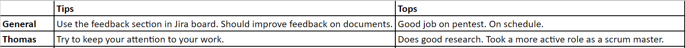

### Taken
Mijn taak tijdens deze sprint was, naast scrum master, voornamelijk gericht omtrent documentatie en de website. 
De taken deze sprinten waren dus als volgt:
- Rapportages van diverse pentesten
- Research report
- Website uitbreiden

### Review
Aan het einde van elke sprint wordt er teruggekeken op het functioneren van zowel de groep als de individuen. Het doel is om aan de feedback van mijn groepsgenoten te werken, 
met als doel om mij als professional te ontwikkelen. Het is de bedoeling dat ik bij elke sprint de feedback heb meegenomen en heb laten zien dat ik mezelf heb ontwikkeld.

Als groepsfeedback hebben we genoteerd dat we beter het Jira board moeten gebruiken omtrent ons project. Dit board is bedoeld
 als een Scrum board en is verdeeld in verschillende fases van taken. Zo zijn er de volgende fasen: backlog, in progress, feedback en done.
 Echter, vergeet onze groep de feedback sectie wel eens. Zo staan er veel issues op feedback en kijkt niemand er naar om. Zelfs worden
 issues soms direct op done gezet en wordt de feedback sectie vergeten.  Je zou zeggen dat dit afhankelijk is van de scrum master,
 alleen dat is niet zo. Alle groepsgenoten hebben de verantwoordelijkheid om hun issues te verslepen en feedback te vragen aan andere.    
 Verder moet er meer aandacht besteed worden aan de feedback van documenten. Zo was het AirScrubber rapport erg slecht gemaakt en hebben wij dit als
 groep niet goed onder de loop genomen.
 
 Buiten dit om lopen wij wel op schema en dat is erg positief. Verder zijn alle pentesten goed verlopen en hebben we mooie resultaten gehaald uit deze testen.
 
Met mijn eigen feedback ben ik tevreden, want t.o.v. de feedback van [sprint 1](/project/sprint_1) ben ik verbeterd. Ik ben als scrum master
meer bezig geweest met hoe het met de taken op het board zit. Zo ben ik achter mensen aangegaan over wat ze doen, hoe ver ze zijn etc.
Elke ochtend maak ik voor iedereen duidelijk wat ze moeten doen die dag. Ook mijn groep geeft als feedback aan dat ik goed verbeterd ben als
scrum master. Dit is mijn eerste jaar en ben daarom erg tevreden.  
Verder hebben ze aangegeven dat ik goed onderzoek voorafgaand aan een pentest/opdracht.  
De feedback voor volgende sprint is om meer aandacht te besteden aan documentatie die ik maak. Even alles nakijken op spelfouten, verwijzingen,
verkeerde zinsopbouw etc. Zo wordt niet alleen de kwaliteit, maar ook de professionaliteit van het document verhoogd.

