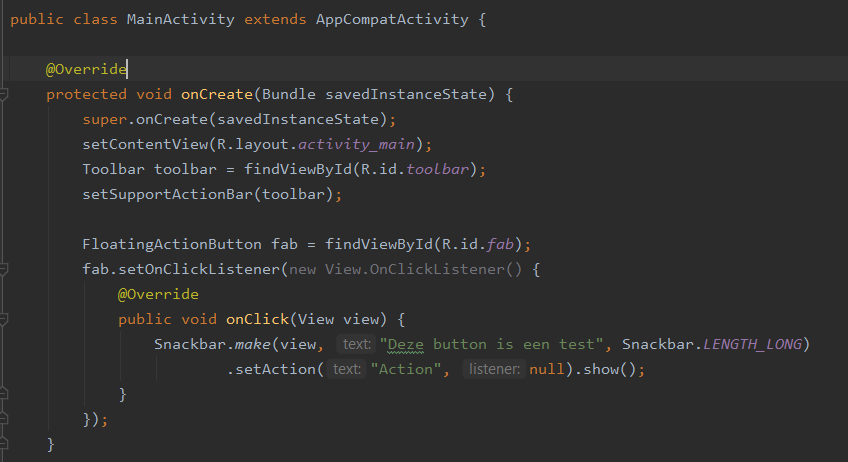
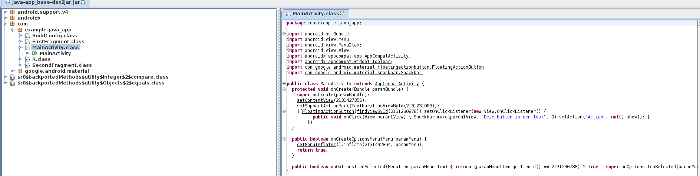

<p style="margin-top: 14px;">Reverse engineering, ook wel backwards engineering genoemd, is het proces om de interne werking
van producten of software te achterhalen. Dit kan bij concurrenten gebeuren, maar ook hackers kunnen hier 
gebruik van maken. Ze zouden hierdoor een gerichtere pentest mee kunnen uitvoeren, doordat ze weten waar de eventuele
zwakke plekken zitten in de software.
</p>
<br />
<br />
<br />
### Workshop
Als introductie in reverse engineeering hebben we een workshop gehad van Max Kersten. Deze workshop
was, ondanks dat deze erg lang duurde, wel leerzaam. Hij heeft me hiermee goed ingeleid in reverse engineering, denk hierbij
aan tools, assembly language en denkwijze.

### Onderzoek
Allereerst heb ik wat onderzoek gedaan naar het onderwerp reverse engineering. Reverse engineering kan gedaan worden bij verschillende applicaties,
denk hierbij aan Android of Iphone apps. Deze apps moeten worden omgezet naar een ``apk``(Android) of ``ipa``(IOS) bestand.
Dit bestand is eigenlijk een gestructureerd ``zip`` bestand, hierin staat de structuur van de applicatie. Hierin zit ook een bestand
die alle *classes*  bevat en die worden gerunt als de applicatie gestart wordt.


Na onderzoek en de workshop gehad te hebben zijn er een aantal tools die handig zijn voor de reversing van applicaties:
- [apktool](https://ibotpeaches.github.io/Apktool/), decoderen van een apk bestand.
- [dnSpy](https://github.com/dnSpy/dnSpy), is een debugger en een .NET assembly editor.
- [Ghidra](https://ghidra-sre.org/), een software reverse engineering tool.
- [dex2jar](https://github.com/pxb1988/dex2jar), ``dex`` bestanden naar een ``jar`` compilen.
- [JD GUI](https://tools.kali.org/reverse-engineering/jd-gui), een GUI voor het openen van ``jar`` bestanden.

### Android app
Allereerst wil ik op een simpele android app reverse engineering toepassen. Hiervoor moet ik eerst een 
android app in elkaar zetten. In deze app heb ik als test een knop aangemaakt die weergeeft "Deze button is een test". Het is de bedoeling dat ik via 
reversing dit te zien krijg, zodat ik weet dat het gewerkt heeft.



Allereerst maak ik van deze applicatie(een "Hello world" app) een apk bestand door middel van een 'extractor' app op de android telefoon.
<br/>
Daarna ben heb ik van het .apk bestand een ZIP bestand gemaakt en uitgepakt. Daardoor is er nu een *classes.dex* bestand te zien:
<br />


Een DEX bestand is een executable die de gecompileerde code bevat and runt op het android platform.
<br />
<br />
Nu heb ik door middel van de de tooling *d2j-dex2jar* een .jar bestand gemaakt van het dex bestand waar de classes zich in bevinden, door dit commando:<br/>
``d2j-dex2jar classes.dex``<br/>
Daarna heb ik de ``jd-gui`` geopend om het jar bestand te bekijken:

In de folder */com* staat een bestand genaamd *example.java_app*, deze ziet er bekend uit en is onze code die geschreven is.

<br/>Dit komt in grote lijnen overeen met de originele code van de app, alleen is er toch wat anders:
- Variabele namen zijn veranderd, bijvoorbeeld ``savedInstanceState`` naar ``paramBundle``.
- ```@override``` is weg
- Het ziet er ingewikkelder uit, omdat alle lege lijnen weg zijn.
- Er staat nu het nummer van het id bij het object i.p.v de ``enum`` zelf.

### Iphone app


### Echte leven
