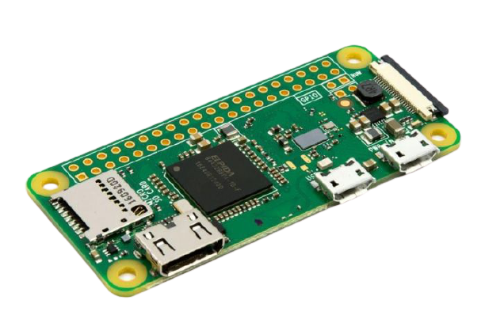

### Raspberry PI Zero W
Dit semester ga ik ook werken met een Raspberry PI Zero W. Voorafgaand had ik niet echt super veel ervaring met een Raspberry, ik ben dus erg benieuwd naar hoe het werkt en wat ik er allemaal mee kan doen.
  25'09'2020 heb ik een Raspberry Pi Zero W besteld bij [Kiwi Electronics](http://kiwi-electronics.nl/).

## Mogelijkheden

## P4WNPI

## Payloads

## Covert channel
