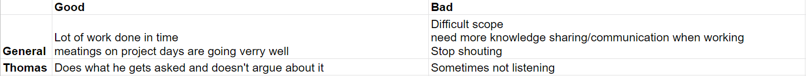

### Taken
**Sprint 1** 
Mijn taak tijdens deze sprint was om mee te werken aan de verschillende documenten. 
In het initiatie document heb ik de volgende dingen gedaan:
- Opzet, inclusief schutblad
- Alle omschrijvingspunten van het project (meegeholpen)
- Interview samenvattingen
- Risk analyse
- Spellingscontrole

In het Onderzoeksplan heb ik het volgende gedaan:
- Spellingscontrole
- Feedback verwerken (Workshop Research - Ron Mélotte)
- Meegeholpen met verschillende onderdelen

Vaak kom ik ook met discussiepunten waar over nagedacht moet worden, zodat we weloverwogen keuzes maken.

Daarnaast was ik in de eerste SCRUM sprint de secretaris. Deze rollen wisselen we elke sprint om, zo hoop ik een keer SCRUM Master te kunnen zijn.
Hier verwacht ik namelijk mezelf meer te kunnen ontwikkelen op het gebied van leiderschap. 

### Review
Aan het einde van elke sprint wordt er teruggekeken op het functioneren van zowel de groep als de individuen. Het doel is om aan de feedback van mijn groepsgenoten te werken,
met als doel om mij als professional te ontwikkelen. Het is de bedoeling dat ik bij elke sprint de feedback heb meegenomen en heb laten zien dat ik mezelf heb ontwikkeld.

Als groepsfeedback hebben we genoteerd dat we veel taken op ons nemen en die ook af krijgen. Bovendien gaan de meetings op projectdagen erg vlot en functioneren wij als team
erg goed. Hier ben ik het ook volledig mee eens, omdat de opdracht op het begin erg vaag was. We wisten niet wat wij moesten doen en de communicatie met de stakeholders was er nauwelijks.
Als team hebben wij dit goed aangepakt en hebben we flinke stappen gemaakt met het project, zowel communicatief als technisch.  

Wel was het feedbackpunt, die vanuit mij kwam, dat er meer kennis verspreid moet worden onder de groepsgenoten. Vaak merk ik dat er een paar groepsgenoten verder zijn wat
betreft kennis of dat er groepsgenoten zijn die hun mening boven iedereen uit schreeuwen. Dit vind ik zelf niet zo prettig en kan me hier zelfs dood aan irriteren.
Ik ben iemand die graag voor iedereen klaar staat, maar ook iemand die graag nieuwe dingen wil leren/ontdekken. Als er dan andere groepsgenoten die taken op zich nemen, omdat ze
dat al goed kunnen of dit gewoon leuk vinden, dan vind ik dit jammer. Zij sluiten zich dan af van de rest(waaronder mij), waardoor ik minder mogelijkheden heb om (van hen) te leren.

Met mijn eigen feedback ben ik tevreden en kan me hier wel in vinden, omdat ik soms wat 'afwezig' kan zijn. Dan ben ik passief aan het luisteren, waardoor ik snel vergeet wat andere voor
ideeën/meningen hadden. Hier kan ik mezelf in verbeteren en dit neem ik dan ook mee in de volgende sprint.  
Alhoewel vinden mijn groepsgenoten wel dat ik alle taken op me neem, zonder daar moeilijk over te doen.
